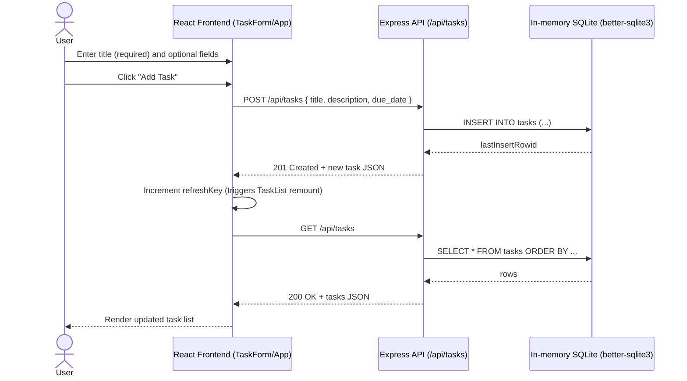

# Cloud Architecture Overview

This monorepo contains a React frontend and an Express API. Data is stored in an in-memory SQLite database (ephemeral; resets on server restart).

## System Context

```mermaid
flowchart LR
  user([User])

  subgraph browser[User Device]
    fe[React Frontend\npackages/frontend]
  end

  subgraph server[App Server]
    api[Express API\npackages/backend]
    db[(In-memory SQLite\n":memory:" via better-sqlite3)]
  end

  user -->|Uses UI in browser| fe
  fe -->|HTTP JSON requests\n/api/tasks| api
  api -->|SQL queries| db
```

## Sequence: Create a TODO


